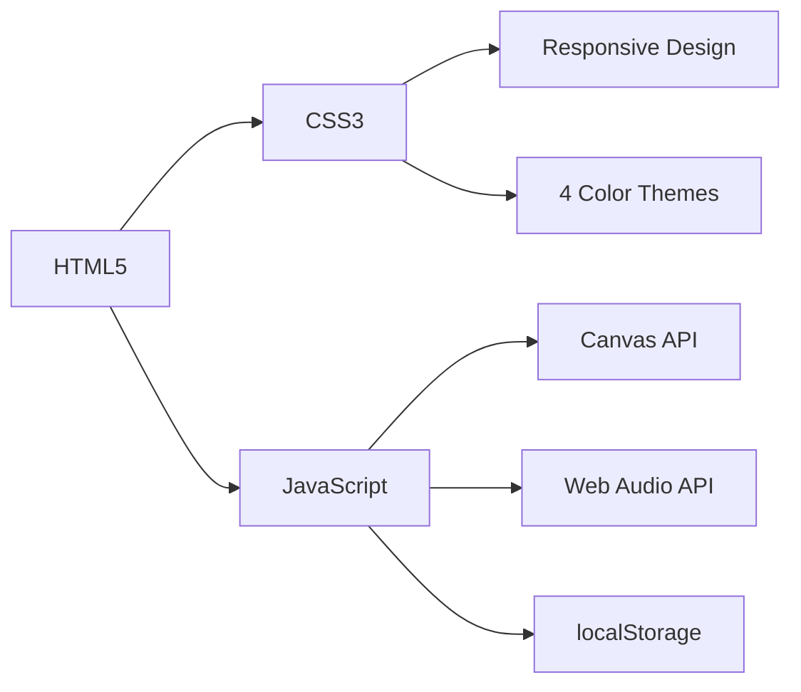

# 🐍 Snake Game

> A classic Snake game with advanced features built with HTML, CSS, and JavaScript.


---

## ✨ Features

| Feature | Description |
|---------|-------------|
| 🎮 **Keyboard Controls** | Arrow keys or WASD to move |
| 🔊 **Sound Effects** | Real-time audio feedback using Web Audio API |
| 🎨 **4 Color Themes** | Neon, Dark, Light, Retro |
| 📐 **Grid Size** | Adjustable (15×15, 20×20, 25×25) |
| 🏃 **Speed Control** | Slow, Normal, Fast, Insane |
| 🧱 **Wall Modes** | Off, Static, Moving walls |
| 👀 **Snake Eyes** | Toggle eye display |
| 📏 **Grid Display** | Toggle grid visibility |
| 🏆 **High Score** | Automatically saved in browser |
| 💾 **Settings** | All preferences saved in localStorage |
| 📱 **Responsive** | Works on all screen sizes |

---

## 🎮 How to Play

1. Use **Arrow Keys** or **WASD** to control the snake
2. Eat the red food to grow and earn points
3. Avoid hitting walls or your own tail
4. The game gets faster every 5 points!
5. Try to beat your high score!

### 🎯 Controls

| Key | Action |
|-----|--------|
| `↑` / `W` | Move Up |
| `↓` / `S` | Move Down |
| `←` / `A` | Move Left |
| `→` / `D` | Move Right |
| `Enter` / `R` | Restart Game |
| `M` | Toggle Sound |

---

## 🛠️ Technologies Used



- **HTML5** - Semantic markup
- **CSS3** - Custom properties, animations, responsive design
- **Vanilla JavaScript** - No external libraries
- **Canvas API** - Game rendering
- **Web Audio API** - Sound effects
- **localStorage** - Save high score and settings

---

## 📁 Project Structure

```
snake-game/
│
├── index.html              # Main HTML file
├── README.md               # Documentation
├── LICENSE                 # License file
├── .gitignore              # Git ignore rules
├── package.json            # Project metadata
│
├── css/
│   ├── style.css           # Base styles
│   ├── theme.css           # Color themes
│   ├── responsive.css      # Media queries
│   └── settings.css        # Settings panel styles
│
├── js/
│   ├── main.js             # Entry point
│   ├── game.js             # Game logic
│   ├── snake.js            # Snake management
│   ├── food.js             # Food management
│   ├── canvas.js           # Rendering engine
│   ├── controller.js       # Keyboard controls
│   ├── score.js            # Score tracking
│   ├── config.js           # Configuration
│   ├── sound.js            # Sound system
│   └── settings.js         # Settings management
│
└── assets/
    └── sounds/             # Sound files (optional)
```

---

## 🚀 Installation & Usage

### Option 1: Play Online
Visit the live demo: [https://sahandsaeidi.github.io/snake-game](https://sahandsaeidi.github.io/snake-game)

---

## 🎨 Theme Preview

| Theme | Preview |
|-------|---------|
| 💜 **Neon** | Cyberpunk style with glowing colors |
| 🌙 **Dark** | Minimal dark design |
| ☀️ **Light** | Clean bright interface |
| 🕹️ **Retro** | Classic arcade feel |

---

## 🔧 Configuration

You can customize the game by modifying `js/config.js`:

```javascript
const CONFIG = {
    GRID_SIZE: 20,           // 15, 20, 25
    INITIAL_SPEED: 150,      // Milliseconds
    MIN_SPEED: 80,           // Fastest speed
    SPEED_STEP: 10,          // Speed increase per level
    SCORE_FOR_SPEED: 5,      // Points needed for speed up
    COLORS: {
        // Customize colors here
    }
};
```

---

## 📱 Responsive Design

The game adapts to all screen sizes:
- **Desktop** - Full experience
- **Tablet** - Optimized layout
- **Mobile** - Touch-friendly controls

---

## 🧪 Browser Compatibility

| Browser | Version | Status |
|---------|---------|--------|
| Chrome | 90+ | ✅ Fully supported |
| Firefox | 88+ | ✅ Fully supported |
| Edge | 90+ | ✅ Fully supported |
| Safari | 14+ | ✅ Fully supported |
| Opera | 76+ | ✅ Fully supported |

---

## 🤝 Contributing

This is a proprietary project, but feedback and suggestions are welcome!

1. Fork the repository
2. Create a feature branch
3. Commit your changes
4. Push to the branch
5. Open a Pull Request

---

## 📝 License

**All Rights Reserved** - This project is proprietary software.

Copyright © 2024 [Your Name]. All rights reserved.

You may NOT:
- Copy or reproduce this code
- Modify or create derivative works
- Use for commercial purposes
- Remove copyright notices


---

## 👨‍💻 Author

**Sahand Saeidi**
- GitHub: [@sahandsaeidi](https://github.com/sahandsaeidi)

---

## ⭐ Show Your Support

If you like this project, please give it a ⭐ on GitHub!

---


## 🎯 Roadmap

- [ ] Add mobile touch controls
- [ ] Add power-ups (speed boost, shield, etc.)
- [ ] Add multiplayer mode
- [ ] Add achievements system
- [ ] Add daily challenges

---

## 🙏 Acknowledgements

- Inspired by the classic Nokia Snake game
- Sound effects generated with Web Audio API

---

**Made with ❤️ by [Sahand Saeidi]**

---

*Version : 1.0*
